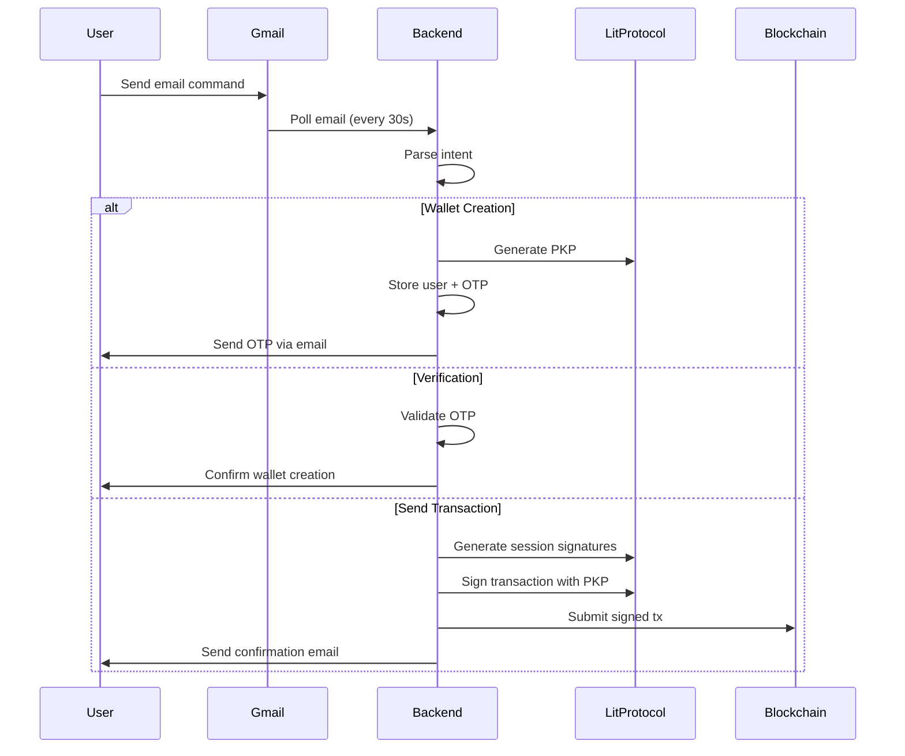

## Vincent DCA backend

This backend provides:

- **Dollar Cost Averaging (DCA)**: Automated investment strategies on Base
- **EmailPay**: Email-native PYUSD wallet powered by Lit Protocol PKP signing

---

## EmailPay Integration

EmailPay enables users to send and receive PYUSD on Sepolia testnet using only email addresses. It leverages Lit Protocol's Programmable Key Pairs (PKPs) for decentralized wallet management and MPC-based transaction signing.

### Features

- **Email-based Wallet Creation**: Users get a PKP wallet by sending an email
- **OTP Verification**: 6-digit OTP sent via email for wallet verification
- **Email Commands**: Send PYUSD, check balance, verify wallet via email
- **Background Processing**: Gmail polling every 30 seconds with Agenda job queue
- **Transaction Limits**: Configurable per-transaction and daily caps for safety
- **PKP Signing**: Session signatures with proper SIWE format on Datil network

### Email Commands

Users can interact with EmailPay by sending emails with these commands:

#### 1. Create Wallet (Automatic)

- **Action**: Send any email to the configured Gmail address
- **System Response**: Creates PKP wallet and sends 6-digit OTP to user's email

#### 2. Verify Wallet

```
VERIFY 123456
```

- **Action**: Verify wallet with OTP received via email
- **Response**: Confirmation email with wallet address

#### 3. Check Balance

```
BALANCE
```

- **Response**: Email with current PYUSD balance

#### 4. Send PYUSD

```
SEND 10 PYUSD TO recipient@example.com
```

- **Amount**: Decimal number (e.g., 10, 5.5, 100)
- **Asset**: Must be "PYUSD"
- **Recipient**: Email address of recipient (must have verified wallet)
- **Response**: Transaction confirmation email with transaction ID

### API Endpoints

#### Create Wallet

```http
POST /emailpay/wallets/create
Content-Type: application/json

{
  "email": "user@example.com"
}
```

#### Verify Wallet

```http
POST /emailpay/wallets/verify
Content-Type: application/json

{
  "email": "user@example.com",
  "otpCode": "123456"
}
```

#### Get Wallet Info

```http
GET /emailpay/wallets/:email
```

#### Get Transaction Details

```http
GET /emailpay/transactions/:txId
```

### Configuration

Add these variables to your `.env` file:

```bash
# Sepolia RPC and Chain ID
SEPOLIA_RPC=https://sepolia.gateway.tenderly.co
CHAIN_ID=11155111

# PYUSD Token Address (Sepolia)
PYUSD_ADDRESS=0xCaC524BcA292aaade2DF8A05cC58F0a65B1B3bB9

# Lit Protocol Network
LIT_NETWORK=datil

# Gmail API Configuration
GMAIL_CLIENT_ID=your-client-id.apps.googleusercontent.com
GMAIL_CLIENT_SECRET=your-client-secret
GMAIL_REFRESH_TOKEN=your-refresh-token
GMAIL_USER=your-email@gmail.com
GMAIL_POLL_QUERY=in:inbox newer_than:1d

# Transaction Limits
MAX_TX_AMOUNT=100
DAILY_TX_CAP=500
TX_EXPIRY_MINUTES=30

# Hot Wallet for Gas Fees
HOT_WALLET_PRIVATE_KEY=0x...
```

### Gmail API Setup

1. Go to [Google Cloud Console](https://console.cloud.google.com/)
2. Create a new project or select existing
3. Enable Gmail API
4. Create OAuth 2.0 credentials (Desktop app)
5. Generate refresh token using `scripts/generate-gmail-token.js` (from EmailPay project)
6. Add credentials to `.env` file

### How It Works



### Architecture

```
packages/dca-backend/src/lib/
├── services/
│   ├── pkpWalletManager.ts      # PKP wallet creation & signing
│   ├── gmailPoller.ts            # Gmail API integration
│   └── intentParser.ts           # Email command parsing
├── mongo/models/
│   ├── EmailPayUser.ts           # User wallets
│   └── EmailPayTransaction.ts    # Transaction records
├── express/
│   ├── emailpay-wallets.ts       # Wallet API routes
│   └── emailpay-transactions.ts  # Transaction API routes
└── agenda/jobs/
    └── emailpay.ts               # Background jobs
```

### Background Jobs

1. **emailpay-poll-gmail**: Polls Gmail every 30 seconds for new emails
2. **emailpay-process-verification**: Verifies OTP and confirms wallet
3. **emailpay-process-send-transaction**: Creates pending transaction
4. **emailpay-execute-transaction**: Signs with PKP and submits to blockchain
5. **emailpay-process-balance-check**: Fetches and emails PYUSD balance

### Testing

1. **Start MongoDB**:

   ```bash
   pnpm mongo:up
   ```

2. **Install dependencies**:

   ```bash
   pnpm install
   ```

3. **Configure EmailPay** (add Gmail credentials and hot wallet to `.env`)

4. **Start backend**:

   ```bash
   pnpm dev
   ```

5. **Send test email** to configured Gmail with command like:

   ```
   BALANCE
   ```

6. **Monitor logs** for email processing and PKP signing

### Troubleshooting

#### Session Signature Errors

- Ensure `LIT_NETWORK=datil` (not deprecated Habanero)
- Verify hot wallet has Sepolia ETH for gas
- Check that SIWE message format includes proper nonce

#### Gmail Polling Not Working

- Verify Gmail API credentials are correct
- Check OAuth 2.0 consent screen is configured
- Ensure refresh token has not expired

#### Transaction Failures

- Verify PYUSD_ADDRESS matches Sepolia deployment
- Ensure sender has sufficient PYUSD balance
- Check recipient has verified wallet
- Verify transaction hasn't expired (TX_EXPIRY_MINUTES)

### Security Considerations

- **Transaction Limits**: MAX_TX_AMOUNT and DAILY_TX_CAP prevent large unauthorized transfers
- **OTP Verification**: 6-digit OTP required before wallet can transact
- **Transaction Expiry**: Pending transactions expire after configured minutes
- **Hot Wallet**: Only pays gas fees, never holds user funds
- **PKP Keys**: Stored on Lit Protocol network, never exposed to backend

### Dependencies

EmailPay requires these additional packages:

- `@lit-protocol/pkp-ethers`: PKP wallet integration
- `googleapis`: Gmail API client
- `siwe`: Sign-In With Ethereum message format
- `uuid`: Transaction ID generation
- `ethers`: v6.15.0 for Ethereum interactions

---

## License

See [LICENSE](../../LICENSE) for details.
